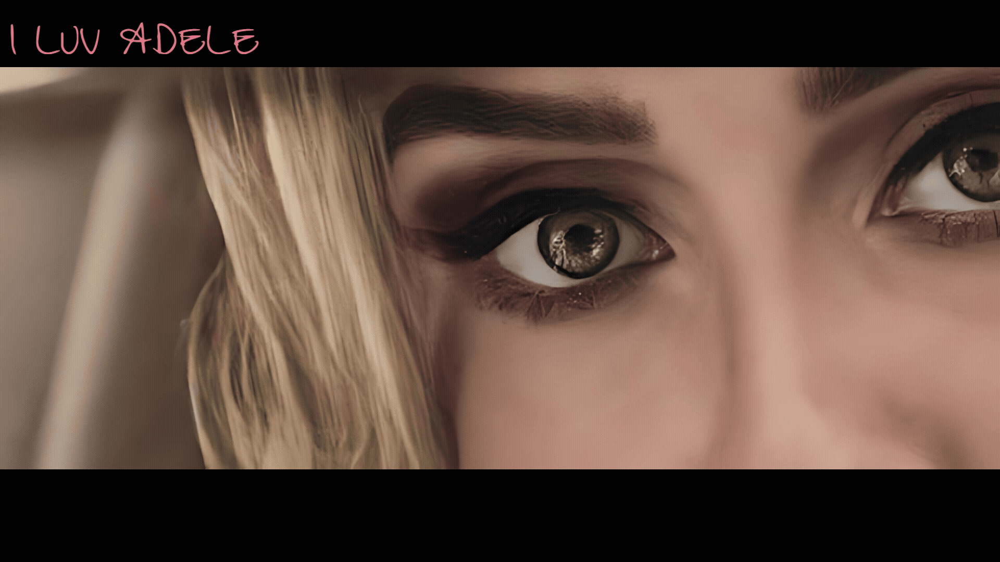

  

## 👋 Hi, I’m Ajay Laxmi Virendra
🎬 **RawatJi** — learning, building, and figuring things out one chapter at a time.  
🤝 Open to collaboration.

### 🌐 Portfolio
🔗 [https://ajy-ocean.github.io/rawatji/](https://ajy-ocean.github.io/rawatji/)

### 🤝 Connect with me

---

  <i>Currently in season one. Character development in progress.</i>

---

### 📊 GitHub Stats

  

